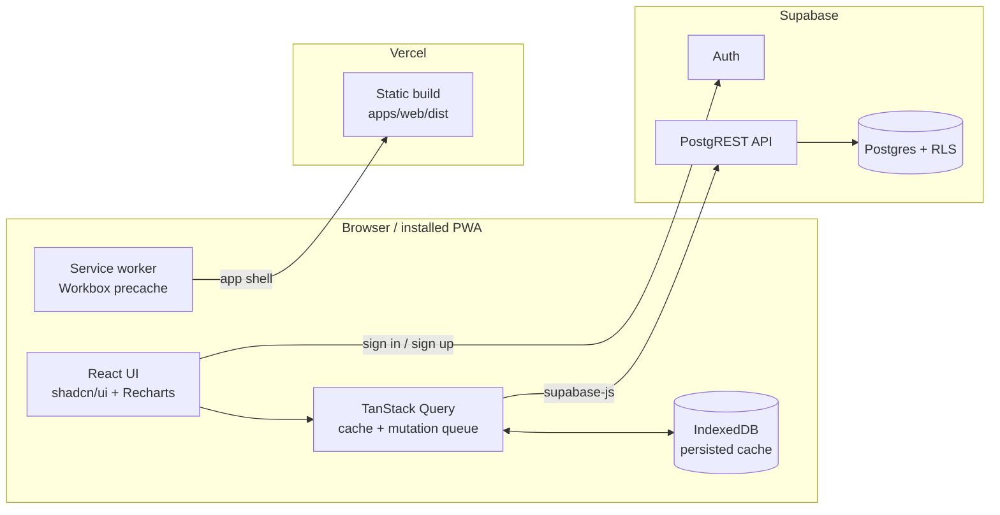

# Architecture

## Overview

There is no custom backend server. The browser talks to Supabase directly with the **publishable**
key. Security comes from Postgres Row Level Security: every query runs as the signed-in user, and
the policies only allow access to rows where `user_id = auth.uid()`.

## Frontend layers

| Layer | Location | Responsibility |
| --- | --- | --- |
| Routes | `src/router.tsx` | `/` landing, `/login`, `/app` (dashboard), `/app/tasks`. `/app/*` is behind `RequireAuth` and lazy-loaded |
| Pages / components | `src/features/*`, `src/pages` | Rendering and user interaction only |
| Hooks | `features/*/queries.ts` | `useTasks`, `useCreateTask`, … Components only use these |
| Mutation logic | `features/*/mutations.ts` | Optimistic cache updates, rollback, refetch. Registered as defaults on the QueryClient |
| API | `features/*/api.ts` | Thin typed wrappers over `supabase.from(...)` |
| Domain | `packages/shared` | DB types (generated), Zod schemas, pure functions like `computeTaskStats` |

## Offline and caching

Modelled on `rfid-pwa-app` (Angular `ngsw`), reimplemented for Vite:

| Concern | rfid-pwa-app | This project |
| --- | --- | --- |
| App shell | `ngsw` `assetGroups` prefetch | `vite-plugin-pwa` (Workbox `generateSW`) precaches all built JS/CSS/HTML/icons |
| SPA navigation offline | `navigationRequestStrategy` | Workbox `navigateFallback: /index.html` |
| API data offline | `dataGroups` freshness cache on `/api/**` | TanStack Query cache persisted to IndexedDB (`networkMode: offlineFirst`) |
| Writes while offline | none | TanStack mutations pause offline, are persisted, and replay on reconnect |
| Updates | `SwUpdate` | `registerType: 'prompt'`: a toast offers **Reload** when a new deploy is available |

Why the API isn't cached in the service worker: the SW cache is shared by everyone who uses the
browser and knows nothing about auth, so cached Supabase responses could leak between accounts. The
TanStack cache is cleared on sign-out (`AuthProvider`). See ADR-004 in `DECISIONS.md`.

### Offline write lifecycle

1. User creates/edits/deletes a task. The mutation's `onMutate` updates the cached list right away.
2. Offline, TanStack pauses the mutation. `SyncStatus` in the header shows "N changes will sync".
3. The cache and paused mutations are persisted to IndexedDB (`tms-query-cache`).
4. On reconnect (or on next app start, via `resumePausedMutations` in `App.tsx`) the mutations
   replay in order. The mutation function is looked up by `mutationKey` from the registered
   defaults, which is why the logic can't live inline in `useMutation`.
5. `onSettled` refetches the list so the cache matches the server.

Creates are idempotent (client-generated UUID + upsert), so a replay after a lost response can't
create duplicates. Conflict policy is last write wins.

### Auth offline

`supabase-js` keeps the session in `localStorage`. `getSession()` reads it without a network call,
so a user who signed in before going offline stays signed in. Sign-in and sign-up need a connection
and the login form says so.

## Styling

Tailwind v4 + shadcn/ui (`radix-nova` style). Theme tokens are in `apps/web/src/index.css`.
The product palette is navy ink (`--primary`), cool paper (`--background`), marker yellow
(`--marker`, used for the landing hero and logo) and a reserved `--overdue` red. `--chart-1` was checked
for contrast in light and dark mode. Headings use Bricolage Grotesque; UI text uses Geist. Both
fonts are self-hosted via Fontsource, so they work offline.
