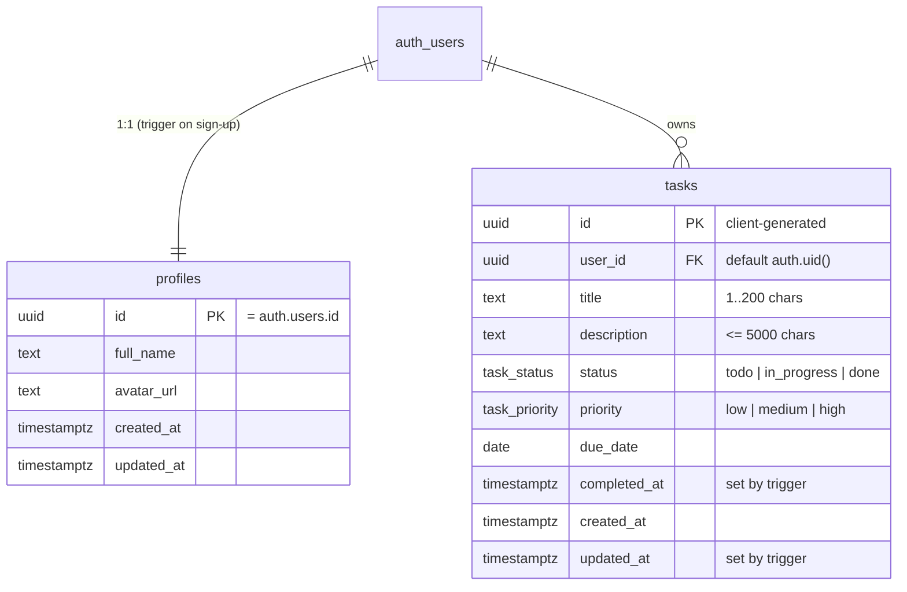

# Data model

Source of truth: `supabase/migrations/`. Generated TypeScript types:
`packages/shared/src/database.types.ts` (regenerate with `pnpm db:types`).

## Behaviour in the database

| Object | What it does |
| --- | --- |
| `handle_new_user()` trigger on `auth.users` | Inserts a `profiles` row using `raw_user_meta_data.full_name` from sign-up |
| `set_updated_at()` trigger | Keeps `updated_at` current on every update |
| `set_task_completed_at()` trigger | Stamps `completed_at` when status becomes `done`, clears it when reopened. Powers the "Completed in the last 14 days" chart |
| Indexes | `(user_id, status)`, `(user_id, due_date)` |

## Row Level Security

RLS is enabled on every table. Policies are for the `authenticated` role only, so anonymous
requests with the publishable key can't read or write anything.

| Table | select | insert | update | delete |
| --- | --- | --- | --- | --- |
| `profiles` | own row | via trigger only | own row | cascade from `auth.users` |
| `tasks` | own rows | `user_id = auth.uid()` | own rows | own rows |

Policies use `(select auth.uid())` rather than `auth.uid()` so Postgres evaluates it once per query,
not once per row (Supabase performance advice).

## Validation

The same limits are enforced twice: as Zod rules in `packages/shared/src/task.ts` (form errors in
the UI) and as `CHECK` constraints in SQL (the real guarantee). If you change one, change both.
