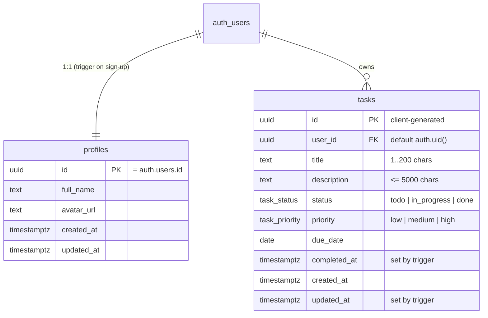

# Data model

Source of truth: `supabase/migrations/`. Generated TypeScript types:
`packages/shared/src/database.types.ts` (regenerate with `pnpm db:types`).

## Behaviour in the database

| Object | What it does |
| --- | --- |
| `handle_new_user()` trigger on `auth.users` | Inserts a `profiles` row using `raw_user_meta_data.full_name` from sign-up |
| `set_updated_at()` trigger | Keeps `updated_at` current on every update |
| `set_task_completed_at()` trigger | Stamps `completed_at` when status becomes `done`, clears it when reopened. Powers the "Completed in the last 14 days" chart |
| Indexes | `(user_id, status)`, `(user_id, due_date)` |

## Row Level Security

RLS is enabled on every table. Policies are for the `authenticated` role only, so anonymous
requests with the publishable key can't read or write anything.

| Table | select | insert | update | delete |
| --- | --- | --- | --- | --- |
| `profiles` | own row | via trigger only | own row | cascade from `auth.users` |
| `tasks` | own rows | `user_id = auth.uid()` | own rows | own rows |
| `punchy_usage` | none | none | none | none |

`punchy_usage` is the one table without an owner: it holds rate-limit counters for the Punchy
assistant (`bucket`, `window_start`, `count`). RLS is on with no policies and grants are revoked from
`anon`/`authenticated`, so only the service role (the Edge Function) touches it, through
`punchy_take_quota(bucket, window_seconds, limit)`, a `security definer` function that only
`service_role` may execute. Rows older than 2 days are cleaned up opportunistically. See ADR-008.

The `private` schema (not exposed by the API) holds `punchy_events`, one row per Punchy request
with hashed IP / device / browser-signature identifiers, browser and OS family, account id and
outcome (30-day retention), plus review views `punchy_suspicious_devices`, `punchy_user_activity`
and `punchy_daily_traffic`. Only `punchy_guard(...)` (service role only) writes to it. See ADR-012.

`email_registered(p_email)` is a `security definer` function (service role only) that answers
whether an email already has an account in `auth.users`, case-insensitively. Only the
`check-email` Edge Function calls it, rate limited per IP. See ADR-010.

Policies use `(select auth.uid())` rather than `auth.uid()` so Postgres evaluates it once per query,
not once per row (Supabase performance advice).

## Validation

The same limits are enforced twice: as Zod rules in `packages/shared/src/task.ts` (form errors in
the UI) and as `CHECK` constraints in SQL (the real guarantee). If you change one, change both.
