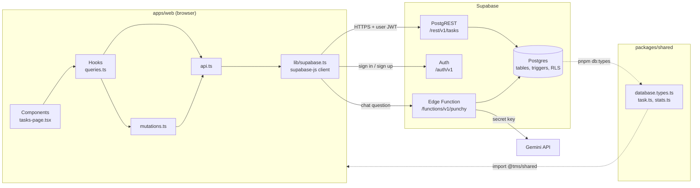

# Project structure

Where things live, where the frontend ends and the backend begins, and how the code maps onto
MVC. For the offline and caching design, see [ARCHITECTURE.md](ARCHITECTURE.md). For tables and RLS,
see [DATA_MODEL.md](DATA_MODEL.md).

## Frontend vs backend at a glance

| | Frontend (FE) | Backend (BE) |
| --- | --- | --- |
| What it is | React PWA running in the browser | Supabase: Postgres + Auth + auto-generated REST API (PostgREST) |
| Code in this repo | `apps/web/` | `supabase/`: SQL migrations, `config.toml`, Edge Functions |
| Shared by both | `packages/shared/`: types generated from the DB, Zod schemas, pure logic | ← same |
| Hosted on | Vercel (static files only) | Supabase project `dmwmeefalvjmazlgzprp` |
| Deployed by | Push to `main` | `pnpm db:push` (schema), `pnpm fn:deploy` (Edge Functions), `supabase config push` (auth settings; passkeys via Management API) |
| Language | TypeScript / TSX | SQL (tables, triggers, RLS); TypeScript on Deno for Edge Functions |

**There is no always-on server.** We don't write Express/Nest routes for CRUD. Supabase generates
a REST endpoint for every table (`/rest/v1/tasks`), and the browser calls it through `supabase-js`.
Most "backend logic" is SQL: constraints, triggers and Row Level Security policies (ADR-003 in
[DECISIONS.md](DECISIONS.md)). Code that needs a secret or elevated access runs in a **Supabase Edge Function**:
`punchy`, the chat assistant, which holds the Gemini key (see [PUNCHY.md](PUNCHY.md)), and
`check-email`, the sign-up form's duplicate-email check (see [AUTH.md](AUTH.md)).

## Folder tree

```text
task-management-system/
├── apps/
│   └── web/                          FRONTEND: the only deployable app
│       ├── index.html                HTML shell Vite injects the bundle into
│       ├── vite.config.ts            Vite + React + Tailwind + PWA (service worker) config
│       ├── pwa-assets.config.ts      Generates the PWA icons in public/
│       ├── components.json           shadcn/ui CLI config
│       ├── .env.example              VITE_SUPABASE_URL, VITE_SUPABASE_PUBLISHABLE_KEY
│       ├── public/                   Static files served as-is (icons, og-image.png, robots.txt, sitemap.xml)
│       └── src/
│           ├── main.tsx              Entry point: mounts <App />
│           ├── App.tsx               Providers: theme, TanStack Query (+ IndexedDB), auth, router, toasts
│           ├── router.tsx            All routes. /app/* is behind <RequireAuth> and lazy-loaded
│           ├── index.css             Tailwind + theme tokens (colours, fonts), global rules
│           ├── pages/                Public pages not tied to a feature (landing + FAQ, 404, route error)
│           ├── features/             One folder per feature. Most work happens here
│           │   ├── auth/             Session, route guard, sign-in/sign-up (validation, password meter),
│           │   │                     passkeys (dialog, errors), duplicate-email check api
│           │   ├── tasks/            Task CRUD (see "Inside a feature folder" below)
│           │   ├── dashboard/        Dashboard page, charts, completions-by-day helper
│           │   └── punchy/           "Ask Punchy" chat: launcher button, lazy panel, api.ts
│           ├── components/
│           │   ├── ui/               shadcn/ui primitives. Generated: re-add via CLI, don't hand-edit
│           │   ├── layout/           App shell: sidebar + header for signed-in pages
│           │   └── *.tsx             App-wide pieces: logo, theme toggle, sync status, PWA update toast
│           ├── hooks/                Generic React hooks (online status, mobile breakpoint)
│           └── lib/                  Singletons and helpers: Supabase client, QueryClient, env, dates, seo, device
│
├── packages/
│   └── shared/                       SHARED: imported by the web app as @tms/shared
│       └── src/
│           ├── database.types.ts     Generated from the live schema by `pnpm db:types`. Don't edit
│           ├── task.ts               Task types, labels, Zod form schema (mirrors DB CHECKs)
│           ├── stats.ts (+ .test)    computeTaskStats: pure dashboard aggregation
│           ├── punchy.ts (+ .test)   Punchy contract, guardrails, prompt. No imports: also used by the Edge Function
│           ├── account.ts (+ .test)  Email format + password rules/strength. No imports: also used by check-email
│           ├── client-signals.ts     Device ID / browser signature / user-agent helpers for Punchy's abuse guard
│           └── index.ts              Public exports
│
├── supabase/                         BACKEND
│   ├── config.toml                   Project config (auth settings, site URL, local dev ports)
│   ├── migrations/                   Schema history. Source of truth. One file per change
│   │   ├── *_init_schema.sql         profiles + tasks, enums, triggers, RLS policies
│   │   ├── *_punchy_rate_limits.sql  Rate-limit counters (service role only)
│   │   ├── *_email_check.sql         email_registered() for the duplicate-email check (service role only)
│   │   └── *_punchy_abuse_guard.sql  punchy_guard(), private.punchy_events + review views
│   └── functions/                    Edge Functions (Deno), deployed with `pnpm fn:deploy`
│       ├── _shared/                  Supabase clients, rate limiting, IP hashing, CORS/origins
│       ├── punchy/                   Assistant: index.ts → guard.ts (limits) → service.ts → repository.ts
│       └── check-email/              Sign-up duplicate-email check
│
├── docs/                             Architecture, data model, decisions, deployment, progress
├── AGENTS.md                         Rules for contributors and AI agents. Read first
├── vercel.json                       Build command, SPA rewrites, cache headers
├── pnpm-workspace.yaml               Declares apps/* and packages/* as workspace packages
└── package.json                      Root scripts (dev, build, lint, db:*)
```

### Inside a feature folder

Every feature that reads or writes data follows the same layering. `features/tasks/` is the model to
copy:

| File | Layer | What it does | Who imports it |
| --- | --- | --- | --- |
| `api.ts` | Data access | Raw `supabase.from('tasks')...` calls. Throws on error | Only `queries.ts` and `mutations.ts` |
| `keys.ts` | Cache keys | TanStack Query keys for the list and each mutation | `queries.ts`, `mutations.ts` |
| `mutations.ts` | Write logic | Optimistic cache update, rollback on error, refetch after. Registered once on the QueryClient so offline writes survive a reload | `lib/query-client.ts` |
| `queries.ts` | Hooks | `useTasks`, `useCreateTask`, `useUpdateTask`, `useDeleteTask` | Components |
| `*-page.tsx`, `*-dialog.tsx`, … | UI | Render and handle user input. Never call Supabase directly | Router, other components |

The rule of thumb: **components → hooks → mutations/api → Supabase**. Arrows only point right.

## Where the frontend meets the backend



Three things cross the boundary:

1. **HTTP requests.** `lib/supabase.ts` is the only place that creates a client. Every data call
   goes through it with the signed-in user's JWT, so Postgres knows who is asking.
2. **Auth.** `features/auth/auth-provider.tsx` holds the session. `supabase-js` stores it in
   `localStorage` and refreshes it.
3. **Types.** The DB schema is turned into TypeScript by `pnpm db:types`. If you change a table and
   forget to regenerate, the FE will typecheck against the old shape.

### What runs where

| Concern | Runs in | File |
| --- | --- | --- |
| "Title is required, max 200 chars" (friendly message) | FE | `packages/shared/src/task.ts` (Zod) |
| "Title is 1–200 chars" (enforced) | BE | `CHECK` constraint in the migration |
| Only see/edit your own tasks | BE | RLS policies on `tasks` |
| `user_id` filled in | BE | Column default `auth.uid()` |
| `completed_at` set when status becomes done | BE | `set_task_completed_at` trigger |
| Profile row on sign-up | BE | `handle_new_user` trigger |
| Show the change instantly, undo on error | FE | `features/tasks/mutations.ts` |
| Queue writes while offline | FE | TanStack Query + `lib/query-client.ts` |
| Dashboard numbers | FE | `computeTaskStats` in `packages/shared` |
| Punchy answers, guardrails, rate limits, Gemini key | BE | `supabase/functions/punchy/` |
| Punchy chat UI, turning suggestions into navigation or a prefilled form | FE | `features/punchy/` |
| "Enter a valid email", password meter, "Passwords don't match" | FE | `packages/shared/src/account.ts`, `features/auth/login-page.tsx` |
| Password rules enforced, emails unique | BE | Supabase Auth settings, `auth.users` |
| "An account with this email already exists" before submit | BE | `supabase/functions/check-email/` + `email_registered()` |

FE validation is for the user; BE constraints are for correctness. Anything that must be true
regardless of what the client sends belongs in the BE.

## Walkthrough: creating a task

1. User fills in the form in `features/tasks/task-form-dialog.tsx`. Zod (`taskFormSchema`) validates it.
2. The dialog calls `useCreateTask().mutate({ id: crypto.randomUUID(), ...values })`.
3. `mutations.ts` adds the task to the cached list straight away (optimistic), then calls
   `api.createTask`.
4. `api.ts` sends `supabase.from('tasks').upsert(...)`, an HTTPS `POST /rest/v1/tasks` with the JWT.
5. Supabase checks the RLS insert policy, fills `user_id`, runs the triggers, checks constraints,
   writes the row and returns it.
6. `mutations.ts` refetches the list so the cache matches the server. On error it restores the
   previous list and shows a toast.

Offline, step 4 is paused and stored in IndexedDB, then replayed on reconnect. See the offline
write lifecycle in [ARCHITECTURE.md](ARCHITECTURE.md).

## Is this MVC?

Not in the classic server sense, because there is no server to put controllers in. The same
separation exists; it's just split between the browser and the database:

| MVC role | Here | Files |
| --- | --- | --- |
| **Model** (data, rules) | Postgres schema, constraints, triggers, RLS; plus the types and schemas generated from it | `supabase/migrations/`, `packages/shared/` |
| **Controller** (handles actions, talks to the model) | Hooks, mutations and API wrappers | `features/*/queries.ts`, `mutations.ts`, `api.ts` |
| **View** (renders) | React components | `features/*/*.tsx`, `pages/`, `components/` |

### Should the backend be MVC?

Not today. Adding an MVC server (Express, NestJS, Laravel…) in front of Supabase would mean:

- another service to host, secure and deploy;
- re-implementing access control in controllers, or forwarding the user's JWT so RLS still applies;
- two places for business rules instead of one.

For per-user CRUD, that's cost with no benefit. RLS already does what a controller's
"is this your task?" check would do, and does it for every query.

**When it makes sense:** when we need logic the browser can't be trusted with, like calling a
third-party API with a secret key, sending emails, or operating across users. That code goes in
**Supabase Edge Functions**, organised with the same layering so they read like MVC. `punchy` is
the first one:

```text
supabase/functions/
  _shared/                 admin client, per-user client, rate limiting, CORS and origin allow-list
  check-email/index.ts     small enough to be controller-only
  punchy/
    index.ts               "controller": CORS, validate request, check auth, rate limit, return JSON
    service.ts             business logic: build prompt, call Gemini, sanitise the answer
    repository.ts          "model" access: Supabase clients, quota RPC, task reads
```

The FE calls it from a feature's `api.ts` (`supabase.functions.invoke('punchy')`), so components
and hooks look the same as for any other data.

## Where to put new code

| You're adding… | Put it in |
| --- | --- |
| A table or column | New migration: `pnpm db:new <name>`, then `pnpm db:push` and `pnpm db:types` |
| A rule that must always hold (limits, ownership, derived columns) | The migration (CHECK, RLS, trigger) |
| Types, Zod schemas, pure calculations | `packages/shared/src/`, exported from `index.ts`, with a test |
| A new data-backed feature | `apps/web/src/features/<name>/` with `api.ts` → `mutations.ts` → `queries.ts` → components |
| A new page | Component in the feature folder + route in `src/router.tsx` (lazy for `/app/*`) |
| A generic UI primitive | `pnpm dlx shadcn@latest add <name>` in `apps/web` → `components/ui/` |
| An app-wide component (header widget, toast) | `apps/web/src/components/` |
| A generic hook | `apps/web/src/hooks/` |
| A client/singleton or small helper | `apps/web/src/lib/` |
| Server-only logic with secrets | `supabase/functions/<name>/` (see above), deploy with `supabase functions deploy <name> --use-api` |
| Something Punchy should know about | `PUNCHLIST_GUIDE` in `packages/shared/src/punchy.ts`, then `pnpm fn:deploy` |
