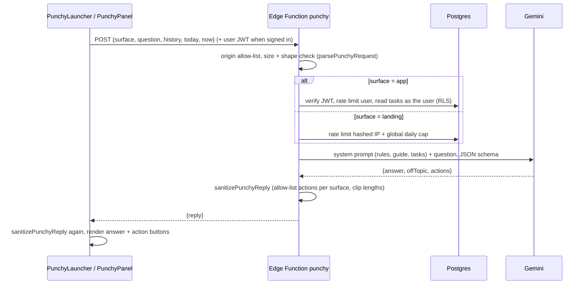

# Punchy (in-app assistant)

Punchy is the chat helper that appears as an **Ask Punchy** button in the bottom-right corner. It
runs in two places:

| Surface | Where | Knows about | Can suggest |
| --- | --- | --- | --- |
| `landing` | Landing page, signed out | The product guide only | Sign up, Sign in, Open dashboard |
| `app` | Every signed-in page (mounted in `AppLayout`) | The product guide + the user's tasks (title, notes trimmed to 300 chars, status, priority, dates) + local date, weekday and time | Open dashboard, Open tasks, Create task (prefilled form) |

Punchy never writes data. A "create task" suggestion shows as a **Suggested task** card (title,
notes, priority, due date) with a **Review and add** button that opens the normal task form
prefilled; the user saves it like any other task.

### Drafting tasks

Punchy fills drafts in like an assistant would: a verb-first title, notes with context from the
chat, priority ("urgent" → High), status, and a due date. Relative dates ("today", "tonight",
"next Friday") become real dates using the local date and weekday the app sends. Tasks have no time
field, so a time goes at the start of the notes ("Due around 10:30 PM."). Follow-ups such as "make
it urgent" edit the latest draft: previous drafts are included in the chat history
(`toPunchyTurn`), and Punchy returns one updated draft.

## How a message flows



## Guardrails

Layered, so no single failure lets Punchy go off script:

1. **Prompt** (`buildPunchyPrompt` in `packages/shared/src/punchy.ts`): scope limited to Punchlist,
   a product guide in plain user language, an explicit "not available" list so it doesn't invent
   features, task titles and history marked as untrusted data, no talk about how the app is built
   or which AI powers it, no claims that anything was changed. The question goes in the user turn;
   everything else goes in Gemini's `systemInstruction`.
2. **Structured output**: Gemini must return JSON matching `PUNCHY_RESPONSE_SCHEMA`.
3. **Server-side sanitising** (`sanitizePunchyReply`): drops action types not allowed on the
   surface, drops task drafts without a title, strips invalid priorities/dates, caps answer length
   and action count, removes all actions from refusals.
4. **Client-side sanitising**: the web app runs the same function on the response.
5. **Actions are allow-listed in the UI**: each action type maps to a fixed navigation or to opening
   the task form. There is no generic "do X" path.
6. **Gemini safety settings** at `BLOCK_LOW_AND_ABOVE` for harassment, hate, sexual and dangerous content.
7. **Input limits**: question ≤ 500 chars, ≤ 6 history turns, body ≤ 16 KB, ≤ 150 tasks in context,
   notes trimmed to 300 chars per task. Notes are treated as untrusted data like titles.

## Rate limits and abuse guard

Every request goes through `guardPunchy()` (`supabase/functions/punchy/guard.ts`), which makes one
call to `punchy_guard()` in Postgres. That call checks the multi-account rule, counts the request
against each bucket in order (the first one over its limit refuses it), and logs the request.
Counters live in `punchy_usage`, so limits hold across Edge Function instances. Fail closed: if the
check errors, the request is refused.

### Signals

| Signal | Source | Why |
| --- | --- | --- |
| Account | Verified JWT (in-app only) | Per-user limits |
| Device ID | Random UUID the browser keeps in `localStorage` (`lib/device.ts`), sent as `x-punchy-device` | Limits follow the browser, not the account |
| Browser signature | SHA-256 of coarse traits (screen, pixel ratio, colour depth, timezone, languages, cores, memory, platform, touch points), sent as `x-punchy-signature`; the server pairs it with the IP | Survives private windows and cleared storage on the same network, without penalising the same phone model elsewhere |
| IP | `x-forwarded-for` | Everyone behind one network; daily caps |
| Browser / OS family | `User-Agent`, parsed coarsely (`parseUserAgent`) | Traffic review; scripts show up as `Script/bot` |

Device ID and signature can be cleared or faked, so they only ever add limits; the IP limits always
apply. All identifiers are HMAC-SHA-256 hashed (keyed with a server secret) before they're counted
or stored.

### Limits (`LIMITS` in `guard.ts`)

| Surface | Bucket | Limit |
| --- | --- | --- |
| Landing | Device ID | 10 / 10 min |
| Landing | Browser signature + IP | 15 / 10 min |
| Landing | IP | 20 / 10 min, 60 / day |
| Landing | All visitors together | 1000 / day |
| App | Account | 30 / 10 min, 200 / day |
| App | Device ID (all accounts on it together) | 40 / 10 min |
| App | IP (all accounts on it together) | 400 / day |
| App | **Accounts per device** (device ID or signature + IP) | 3 per 24 h; the 4th account is refused |
| App | **Accounts per IP** | 10 per 24 h |

The account rules only count accounts that were actually answered in the last 24 hours, so a
refused account doesn't lock out the ones already using the device.

Verified live (2026-09-24): one browser got 10 answers then 429; a "private window" (new device ID,
same signature) got 5 more; another browser on the same network stopped at the IP limit; with one
device, accounts 1–3 were answered, account 4 got "Punchy can only help a few accounts from the same
device or network each day", and account 1 kept working.

### Reviewing traffic

The event log and views live in the `private` schema, which the API doesn't expose. Open them in
the Supabase SQL editor (or Table editor → schema `private`):

```sql
select * from private.punchy_suspicious_devices;  -- devices/browsers with >1 account or refusals (7 days)
select * from private.punchy_user_activity;       -- per account: requests, refusals, devices, networks, email
select * from private.punchy_daily_traffic;       -- per day, surface and outcome (30 days)
select * from private.punchy_events order by created_at desc limit 100;
```

`outcome` is `ok` or the refusal reason: `quota:device`, `quota:fpip`, `quota:ip`, `quota:ipday`,
`quota:global`, `quota:user`, `quota:userday`, `quota:appdevice`, `quota:appipday`,
`accounts:device`, `accounts:ip`. Events are kept 30 days. To act on an abusive account, delete or
ban it in Dashboard → Authentication → Users.

Gemini's own free-tier per-minute quota is a separate ceiling: bursts above it return "Punchy is
getting a lot of questions right now".

## Privacy

- Sent to Gemini: the question, the last few chat turns, today's date and time, and (signed in)
  each task's title, notes (first 300 characters), status, priority, due date and completed date.
- The UI doesn't name vendors or tech, by product decision; the product guide tells users Punchy
  can read their tasks including notes. If Punchlist gets a privacy policy, it should name Google
  Gemini as a processor.
- The Gemini API key lives only in Supabase secrets. Chat history lives in React state and is gone
  on reload or sign-out.
- Abuse tracking stores only keyed hashes of the IP, device ID and browser signature, plus the
  browser/OS family, surface, account id and outcome, for 30 days. The product guide tells users
  Punchy has fair-use limits per device, network and account.

## Files

| File | Role |
| --- | --- |
| `packages/shared/src/punchy.ts` (+ test) | Contract, limits, product guide, prompt, sanitisers. Dependency-free: imported by the web app and by the Edge Function (Deno) |
| `supabase/functions/punchy/index.ts` | Controller: CORS/origin check, validation, auth, rate limits, error responses |
| `supabase/functions/punchy/service.ts` | Gemini call with model fallback (`gemini-3.5-flash-lite` → `gemini-flash-latest`) |
| `supabase/functions/punchy/repository.ts` | Task read as the user; re-exports the shared helpers below |
| `supabase/functions/_shared/supabase.ts` | Admin / per-user clients, JWT check, quota RPC, keyed IP hash (shared with `check-email`) |
| `supabase/functions/_shared/http.ts` | Origin allow-list, CORS, JSON responses, body size limit (shared with `check-email`) |
| `supabase/functions/punchy/guard.ts` | Abuse guard policy: signals, `LIMITS`, user-facing refusal messages |
| `supabase/migrations/*_punchy_rate_limits.sql` | `punchy_usage` table and `punchy_take_quota()` |
| `supabase/migrations/*_punchy_abuse_guard.sql` | `punchy_guard()`, `private.punchy_events`, review views |
| `packages/shared/src/client-signals.ts` (+ test) | Header names, device/signature validation, signature input, UA parsing |
| `apps/web/src/lib/device.ts` | Device ID, browser signature, `deviceHeaders()` |
| `apps/web/src/features/punchy/api.ts` | `askPunchy()` via `supabase.functions.invoke` |
| `apps/web/src/features/punchy/punchy-launcher.tsx` | Button, conversation state, request (always loaded, tiny) |
| `apps/web/src/features/punchy/punchy-panel.tsx` | Chat UI and action handling (lazy-loaded on first open) |

## Changing Punchy

- **New feature in the app?** Update `PUNCHLIST_GUIDE` (and remove it from the "Not available"
  line), or Punchy will keep saying it doesn't exist.
- **New action type?** Add it to `PUNCHY_ACTION_TYPES` and `PUNCHY_ACTIONS_BY_SURFACE`, handle it
  in `run()` in `punchy-panel.tsx`, add a test, and redeploy the function.
- Any change to `punchy.ts`, `supabase/functions/punchy/` or `supabase/functions/_shared/` needs a
  redeploy: `pnpm fn:deploy` (deploys every function).

## Operations

```bash
pnpm fn:deploy                                           # deploy all functions (no Docker needed)
supabase secrets set GEMINI_API_KEY=... --project-ref <ref>   # rotate the key
```

Logs: Supabase Dashboard → Edge Functions → punchy → Logs.

Allowed browser origins are the production URL and `localhost:5173`/`4173`. To allow Vercel preview
deploys or a new domain, set a comma-separated `PUNCHY_ALLOWED_ORIGINS` secret (or edit
`ALLOWED_ORIGINS` in `supabase/functions/_shared/http.ts`) and redeploy. It applies to every function.
